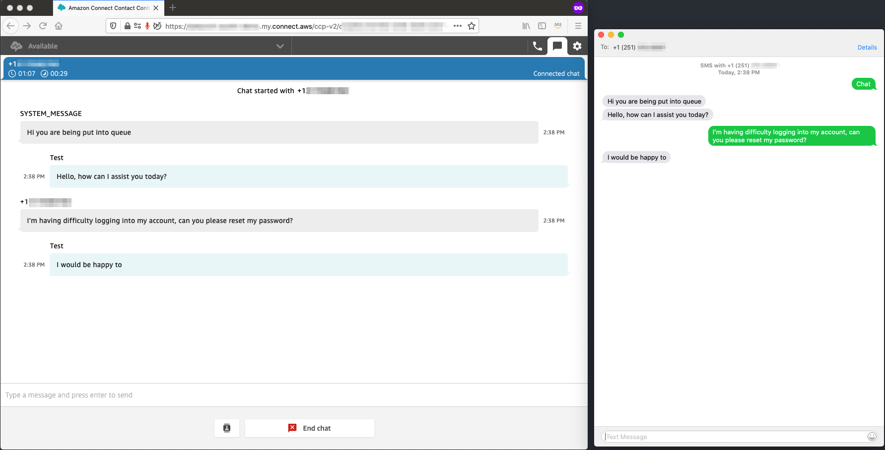

# Amazon Pinpoint SMS Connect Chat Connector

Using this architecture, customers can create a bridge between Amazon Connect and Amazon Pinpoint allowing for end customers to chat with Amazon Connect agents over two-way SMS.  To get started, follow the readme below.  This project contains source code and supporting files for a serverless application that you can deploy with the SAM CLI.



The application uses several AWS resources, including Lambda functions and a Step Functions state machine. These resources are defined in the `template.yaml` file in this project. You can update the template to add AWS resources through the same deployment process that updates your application code.


If you prefer to use an integrated development environment (IDE) to build and test your application, you can use the AWS Toolkit.  
The AWS Toolkit is an open source plug-in for popular IDEs that uses the SAM CLI to build and deploy serverless applications on AWS. The AWS Toolkit also adds a simplified step-through debugging experience for Lambda function code. See the following links to get started.

* [PyCharm](https://docs.aws.amazon.com/toolkit-for-jetbrains/latest/userguide/welcome.html)
* [IntelliJ](https://docs.aws.amazon.com/toolkit-for-jetbrains/latest/userguide/welcome.html)
* [VS Code](https://docs.aws.amazon.com/toolkit-for-vscode/latest/userguide/welcome.html)
* [Visual Studio](https://docs.aws.amazon.com/toolkit-for-visual-studio/latest/user-guide/welcome.html)


## Deployment Steps

### Pre-requisites

#### Amazon Connect

You need an Amazon Connect instance to deploy this [CloudFormation](https://aws.amazon.com/cloudformation/) template. You can use an existing one or create a new one by following our onboarding guide [here](https://docs.aws.amazon.com/connect/latest/adminguide/amazon-connect-get-started.html).

If you are using an existing instance, you may need to make a few changes to your instance to enable Chat. Follow the steps [here](https://github.com/amazon-connect/amazon-connect-chat-ui-examples/blob/master/README.md#enabling-chat-in-an-existing-amazon-connect-contact-center) to see what changes you need to make.

Go into your Amazon Connect instance and go to the Contact Flows page. Create a new contact flow and select 'Import flow' from the upper right hand corner. Import the 'Basic Chat Disconnect Flow' from the 'contactFlows/' in this repo and click 'Publish'. Follow the same steps for the 'Basic Chat Flow'.

#### Amazon Pinpoint

You need an Amazon Pinpoint instance with two-way SMS enabled to deploy this [CloudFormation](https://aws.amazon.com/cloudformation/) template.  You can use an existing one or create a new one by following the onboarding guide [here](https://docs.aws.amazon.com/pinpoint/latest/userguide/gettingstarted-create-project.html).

To enable two-way SMS, follow the user guide steps [here](https://docs.aws.amazon.com/pinpoint/latest/userguide/channels-sms-two-way.html#channels-sms-two-way-configure) and record the SNS Topic Arn.


### Deploy the Infrastructure

The Serverless Application Model Command Line Interface (SAM CLI) is an extension of the AWS CLI that adds functionality for building and testing Lambda applications. It uses Docker to run your functions in an Amazon Linux environment that matches Lambda. It can also emulate your application's build environment and API.

To use the SAM CLI, you need the following tools.

* SAM CLI - [Install the SAM CLI](https://docs.aws.amazon.com/serverless-application-model/latest/developerguide/serverless-sam-cli-install.html)
* [Python 3 installed](https://www.python.org/downloads/)
* Docker - [Install Docker community edition](https://hub.docker.com/search/?type=edition&offering=community)

To build and deploy your application for the first time, run the following in your shell:

```bash
sam build --use-container
sam deploy --guided
```

The first command will build the source of your application. The second command will package and deploy your application to AWS, with a series of prompts:

* **Stack Name**: The name of the stack to deploy to CloudFormation. This should be unique to your account and region, and a good starting point would be something matching your project name.
* **AWS Region**: The AWS region you want to deploy your app to.
* **PinpointProjectId**: The Amazon Pinpoint Project ID that is set up for two-way SMS.
* **SMSSNSTopicArn**: The two-way SMS SNS Topic Arn.
* **ConnectInstanceId**: The Amazon Connect Instance ID
* **ConnectContactFlowId**: The Amazon Connect Contact Flow ID corresponding to the 'Basic Chat Flow' imported previously.
* **Confirm changes before deploy**: If set to yes, any change sets will be shown to you before execution for manual review. If set to no, the AWS SAM CLI will automatically deploy application changes.
* **Allow SAM CLI IAM role creation**: Many AWS SAM templates, including this example, create AWS IAM roles required for the AWS Lambda function(s) included to access AWS services. By default, these are scoped down to minimum required permissions. To deploy an AWS CloudFormation stack which creates or modified IAM roles, the `CAPABILITY_IAM` value for `capabilities` must be provided. If permission isn't provided through this prompt, to deploy this example you must explicitly pass `--capabilities CAPABILITY_IAM` to the `sam deploy` command.
* **Save arguments to samconfig.toml**: If set to yes, your choices will be saved to a configuration file inside the project, so that in the future you can just re-run `sam deploy` without parameters to deploy changes to your application.

## Testing the Solution

While an agent is [logged into the CCP](https://docs.aws.amazon.com/connect/latest/adminguide/ccp-login.html), text the origination id or phone number provisioned in Amazon Pinpoint and setup for two way SMS.  To initiate a new Chat conversation, send the sms message "Chat" to the phone number.

When the agent accepts the incoming chat, a two-way conversation gets created where the agent and the end-user can communicate with each other.

## Cleanup

To delete the sample application that you created, use the AWS CLI. Assuming you used your project name for the stack name, you can run the following:

```bash
aws cloudformation delete-stack --stack-name amazon-pinpoint-sms-connect-chat
```

## Resources

See the [AWS SAM developer guide](https://docs.aws.amazon.com/serverless-application-model/latest/developerguide/what-is-sam.html) for an introduction to SAM specification, the SAM CLI, and serverless application concepts.

Next, you can use AWS Serverless Application Repository to deploy ready to use Apps that go beyond hello world samples and learn how authors developed their applications: [AWS Serverless Application Repository main page](https://aws.amazon.com/serverless/serverlessrepo/)
